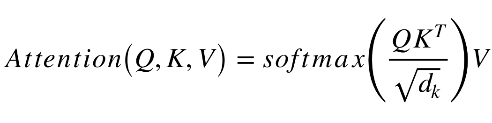

# Transformer
Multi-head Attention Based Transformer Model

## Overview
  * [Intro](#intro)
  * [Requirements](#requirements)
  * [Usage](#usage)
  * [Results](#results)
  * [Dex Swap](#dexswap)
  * [References](#references)


### Intro
  Advancing the deep learning field anew, Transformer networks have become a dominant force to be reckoned with. Taking inspiration from both Gated RNNs and Convolutional Neural Networks, Transformer newtorks intruduced in ["Attention is All You Need"](https://arxiv.org/abs/1706.03762), have brought forth a revolutionary new era for the modeling of long range dynamics. Leveraging a new attention mechanism that encodes positional/temporal alignments, this new architectural structure referred to as Multi-head Attention, is able to simultaneously project corresponding inputs and outputs into a numerical semantic space that allows for the discovery and preservation of relational characterstics across distances and periods of time that have challenged even the most powerful of statistical models. Their use has grown tremendously across the field of machine learning, with application in everything from [language modeling](https://arxiv.org/pdf/1810.04805.pdf), [image generation and classification](https://arxiv.org/pdf/2010.11929.pdf), to [protein folding](https://www.nature.com/articles/d41586-021-03499-y?error=cookies_not_supported&code=80a3df6a-6a29-4845-acb6-1aa735d6e8aa) and [gene expression prediction](https://www.deepmind.com/blog/predicting-gene-expression-with-ai). The Transformer is rapidly tranforming the world around us. Here we demonstrate some of its capabilites with a simple price prediction for ETH/USDC price projections


#### Architecture
The architectural design of the Transformer model is illustrated below. Consisting of an encoder-decoder architecture. The encoder attends to all inputs simultaneously while projecting learnable semantincs into stacked layers of abstraction. The decoder attends to each of the encoder layer's outputs, as well as the output the decoder has generated thus far.


The key innovation lies in the attention mechanism utitlized by each layer in the network to preserve relational structure across what used to be prohbitively long distances.



The illustration below shows us the processing of a single input sequence


### Requirements
  * Linux distributions that use glibc >= v2.17
  * Python 3.6
  * matplotlib == 3.1.1
  * numpy == 1.19.4
  * pandas == 0.25.1
  * scikit_learn == 0.21.3
  * torch == 1.8.0
  * scipy == 1.7.3


Python pakcage dependencies can be installed using the following command:
```
pip install -r requirements.txt
```
Optional - For training on a GPU (highly recommended), Nvidia CUDA 10.0+ drivers are required

### Usage

Input data is ETH-USDC OHLCV

```
date,closing_price,highest_price,lowest_price,open_price,volume
```

In the command line run to launch an interactive python session with a model that will train on an nvidia gpu if one is available and CUDA is installed, or the CPU if no compatble GPU is found.

```python
python -i train.py
```
